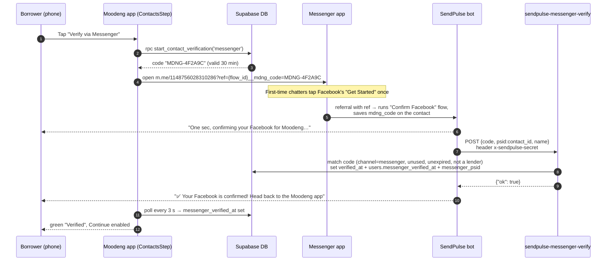
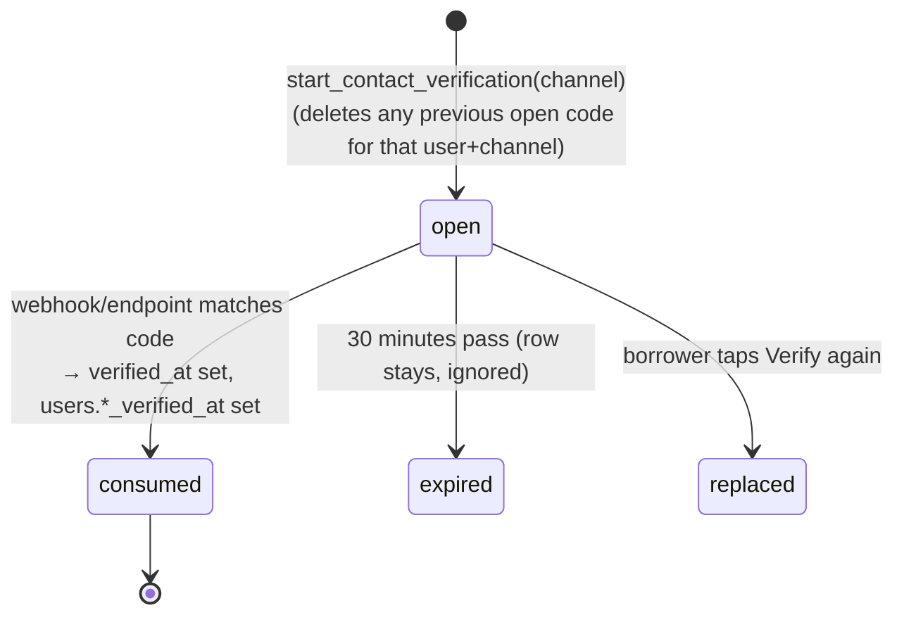
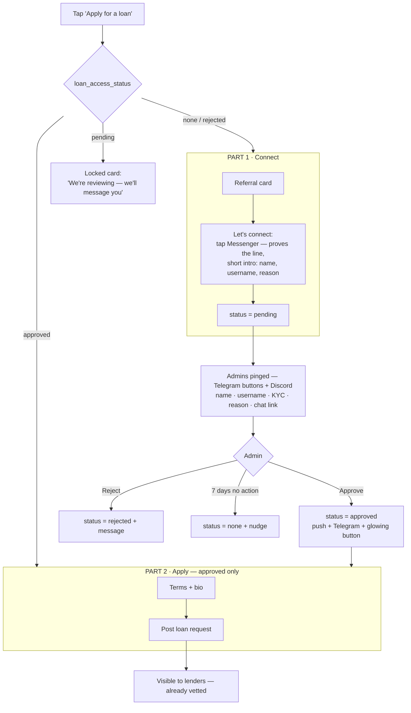
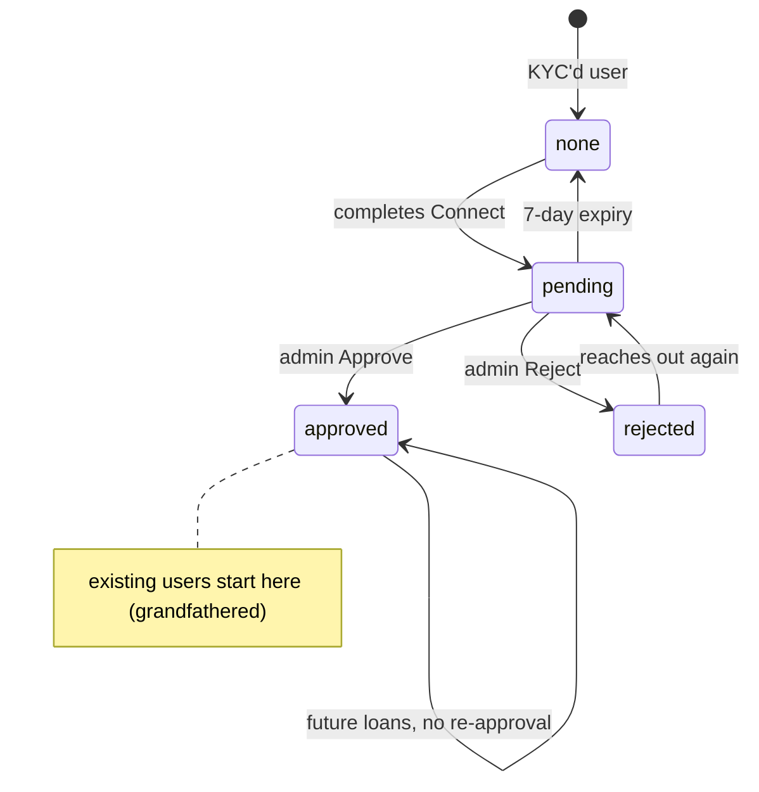

# Moodeng Credit — Borrower Verification & Loan Gating: Complete Handoff

> **What this is:** a self-contained guide to everything built (and planned) around _who a borrower is,
> how we reach them, and when they're allowed to ask for a loan_. It's written so someone opening a new
> account/workspace can understand the **purpose**, the **current live state**, the **database schema**,
> every **moving part**, and the **next system to build** — without any prior context.
>
> **Last updated:** 2026-09-24. **Repo:** `Moodeng-Credit/Moodeng-Credit-Main`.
> **Secrets:** this doc lists secret _names_ only, never values. Every secret must be regenerated in a new
> account (see [§14 Transfer checklist](#14-transfer-checklist)).

---

## Table of contents

1. [Why this exists — the problem we're solving](#1-why-this-exists--the-problem-were-solving)
2. [The trust model in one picture](#2-the-trust-model-in-one-picture)
3. [Current state at a glance](#3-current-state-at-a-glance)
4. [Architecture](#4-architecture)
5. [The borrower's journey today (live)](#5-the-borrowers-journey-today-live)
6. [Facebook Messenger verification (live) — deep dive](#6-facebook-messenger-verification-live--deep-dive)
7. [WhatsApp verification (built, hidden) — status & plan](#7-whatsapp-verification-built-hidden--status--plan)
8. [Video-call step (live) — Cal.com round-robin + reminders](#8-video-call-step-live--calcom-round-robin--reminders)
9. [Team alerts — Discord & Telegram routing](#9-team-alerts--discord--telegram-routing)
10.   [Database schema (the important part)](#10-database-schema-the-important-part)
11.   [Edge functions reference](#11-edge-functions-reference)
12.   [Configuration: secrets, env vars, settings rows](#12-configuration-secrets-env-vars-settings-rows)
13.   [THE NEXT SYSTEM: Connect → Approve → Apply](#13-the-next-system-connect--approve--apply)
14.   [Transfer checklist](#14-transfer-checklist)
15.   [Known issues, risks & open decisions](#15-known-issues-risks--open-decisions)
16.   [History: PRs and key commits](#16-history-prs-and-key-commits)
17.   [How to operate & test](#17-how-to-operate--test)
18.   [Glossary](#18-glossary)

---

## 1. Why this exists — the problem we're solving

**Moodeng Credit** is a peer-to-peer micro-lending platform: borrowers (mostly in Thailand and the
Philippines) post small USDC loan requests; lenders (mostly US/Europe) fund them. Trust is everything —
lenders are sending real money to strangers.

The problems this work addresses, in the founders' own framing:

1. **We can't reliably reach borrowers.** After a loan is funded, borrowers often can't figure out how to
   withdraw, or go quiet near repayment. Without a _proven_ line to them (a chat we know works), support
   and collections are guesswork.
2. **Video-call no-shows.** Borrowers without a referral code had to book a video call. In practice many
   didn't show up — wasting their time and ours.
3. **Unvetted requests get funded.** A borrower can post a request that lenders see and fund _before_ the
   team has ever spoken to them.
4. **Friction kills conversion.** Every extra step (typing codes, waiting for a human, logging in again)
   loses borrowers. So every verification must be **as automated and low-friction as possible** — ideally
   _one tap_ inside apps the borrower is already logged into.

**Design principles that fell out of this:**

- **Prove, don't trust.** A contact line counts only when _our server_ confirms it (a webhook/API tells
  us the borrower actually opened the chat). Nothing the browser says is trusted.
- **Meet borrowers where they're logged in.** Open the Messenger/WhatsApp _app_ (already logged in)
  rather than asking them to log into Facebook inside our site (which on phones often means a password
  prompt).
- **No vendor on the critical path unless it's the only way.** We tried to stay free and self-owned;
  SendPulse was adopted only because Meta's own route needs months of App Review.
- **Facebook first.** A Messenger confirmation ties the borrower to their **real Facebook profile**
  (name, photo, history) — a stronger identity signal than a phone number.

---

## 2. The trust model in one picture

A borrower passes through up to three layers of trust before their request reaches lenders:

```mermaid
flowchart LR
    A[Sign up] --> B[KYC via Didit<br/>ID + liveness + face-duplicate check]
    B --> C[Contact line proven<br/>Facebook Messenger (live)<br/>WhatsApp (later)]
    C --> D{Referral code?}
    D -- yes --> F[Post loan request]
    D -- no --> E[Book a video call<br/>(today) — to be replaced by<br/>human approval (next system)]
    E --> F
    F --> G[Visible to lenders]
```

- **KYC (Didit)** proves _who they are_ (government ID + liveness).
- **Contact line** proves _we can reach them_ (Messenger live, WhatsApp later).
- **Human touch** (today: a booked video call for non-referred borrowers; next: manual approval after
  they message us — see [§13](#13-the-next-system-connect--approve--apply)).

---

## 3. Current state at a glance

| Area                                      | State                                     | Notes                                                                                                      |
| ----------------------------------------- | ----------------------------------------- | ---------------------------------------------------------------------------------------------------------- |
| KYC (Didit)                               | ✅ Live                                   | Pre-existing; alerts to Discord `#kyc` + admin Telegram                                                    |
| **Messenger verification**                | ✅ **Live, one tap**                      | Via SendPulse; merged in #913                                                                              |
| Contact step shows **Messenger only**     | ✅ **Live**                               | WhatsApp hidden by flag; merged in #914                                                                    |
| WhatsApp verification                     | 🟡 Built, **hidden**                      | Runs on Meta's _test_ number; needs George's number moved to WhatsApp Business + coexistence via SendPulse |
| Manual Messenger `/confirm` (admin relay) | ✅ Live fallback                          | From #903; rarely needed now                                                                               |
| Video-call step (no-referral borrowers)   | ✅ Live                                   | Free Cal.com round-robin + reminders; to be replaced by next system                                        |
| Calendly-read availability                | 🟡 Tokens set, **rewrite not done**       | Booker still reads Cal.com availability                                                                    |
| Team alerts (Discord/Telegram)            | ✅ Live                                   | Per-feed Discord webhooks; admin Telegram channel                                                          |
| **Connect → Approve → Apply**             | 📝 **Designed, not built**                | Full spec in [§13](#13-the-next-system-connect--approve--apply)                                            |
| SendPulse billing                         | ⚠️ PRO **trial ends Oct 1 2026** ($12/mo) | Reminder set for Sep 29; free-plan version under investigation                                             |

**Important:** the `staging` branch **is production** — merging to `staging` deploys to the live app
(Vercel). The live Supabase project is `qplmmxynzxzkfxtayoqr` (dashboard name "[Dev]Moodeng" — the name
is misleading; it is prod).

---

## 4. Architecture

```mermaid
flowchart TB
    subgraph Client[React + Vite app (Vercel)]
        LRM[LoanRequestModal<br/>referral → terms → bio → Contact → video call → submit]
        CS[ContactsStep]
        VCS[VideoCallStep]
    end

    subgraph Supabase[Supabase — project qplmmxynzxzkfxtayoqr]
        DB[(Postgres<br/>users, loans,<br/>contact_verification_codes,<br/>telegram_bot_settings …)]
        RPC[RPCs<br/>start_contact_verification<br/>start_whatsapp_verification]
        EF[Edge functions<br/>sendpulse-messenger-verify<br/>whatsapp-webhook · messenger-webhook<br/>calcom-round-robin · calcom-webhook<br/>video-call-reminders · telegram-webhook<br/>loan-request-telegram-notification …]
        CRON[pg_cron jobs]
    end

    subgraph Ext[External services]
        SP[SendPulse<br/>Messenger bot on Moodeng Credit page]
        META[Meta / Facebook<br/>Page 1148756028310286<br/>App 'Moodeng Messaging']
        WA[WhatsApp Cloud API<br/>(test number today)]
        CAL[Cal.com (booking)<br/>Calendly (availability, planned)]
        TG[Telegram bot + admin groups]
        DC[Discord channels]
        DIDIT[Didit KYC]
    end

    CS -- rpc --> RPC --> DB
    CS -- opens m.me link --> META --> SP
    SP -- API request (PRO) --> EF
    CS -- polls users row --> DB
    CS -- opens wa.me link --> WA -- webhook --> EF
    VCS -- functions.invoke --> EF -- book --> CAL
    CAL -- signed webhook --> EF
    CRON --> EF
    EF --> DB
    EF --> TG
    EF --> DC
    DIDIT -- webhook --> EF
```

**Stack:** React + Vite + TypeScript + Tailwind + Redux · Supabase (Postgres, Deno edge functions,
pg_cron, pg_net, Vault) · Vercel hosting · SendPulse · Meta (Messenger/WhatsApp) · Telegram · Discord ·
Cal.com / Calendly · Didit.

---

## 5. The borrower's journey today (live)

When a KYC-verified borrower taps **"Make Your Request" / Apply for a loan**, `LoanRequestModal`
(`src/views/dashboard/components/LoanRequestModal.tsx`) walks them through, in order:

1. **Referral card** — optional code (adds a credit-limit boost, and today _skips the video call_).
2. **Terms** — amount, repayment amount, due date, reason (with low-effort/English checks).
3. **Bio** (first-time borrowers only; pages 1 and 2) — work type, profession, payday window, income,
   expenses, what they need help with. Saved to the user profile so returning borrowers skip it.
4. **Contact** (`ContactsStep`) — **Verify via Messenger** (WhatsApp hidden for now). Required.
5. **Video call** (`VideoCallStep`) — **only if no referral code**: book a slot with the Moodeng team.
6. **Submit** — the loan row is inserted with `loan_status = 'Requested'`, which fires the
   `trigger_notify_loan_request_telegram` trigger (lender broadcast + admin alerts).

A **path-aware progress rail** at the bottom shows "Step X of Y"; referred borrowers visibly have one
fewer step.

---

## 6. Facebook Messenger verification (live) — deep dive

### 6.1 Why SendPulse (the decision trail)

To confirm a borrower's Messenger automatically, _some_ app must be allowed to **receive messages from
the public** on our Facebook Page. Meta only grants that (`pages_messaging`, Advanced Access) after
**App Review + business verification — months**. Alternatives evaluated:

| Option                                                               | Verdict                                                                                                                                             |
| -------------------------------------------------------------------- | --------------------------------------------------------------------------------------------------------------------------------------------------- |
| Our own Meta app + App Review                                        | ❌ Months of review                                                                                                                                 |
| Unofficial GitHub "Facebook chat API" scrapers                       | ❌ Violate Meta ToS, ban-prone, store credentials — unacceptable for a lender                                                                       |
| ManyChat (~$15/mo)                                                   | ❌ Reviews show unexpected card charges + ignored support                                                                                           |
| Manual: borrower sends a code, admin confirms `/confirm` in Telegram | ⚠️ Built (#903) but rejected as primary — too many manual taps                                                                                      |
| "Log in with Facebook" in our site                                   | ❌ On phones runs in the browser (often a password prompt), still needs our own Meta app, and gives identity but no chat line                       |
| **SendPulse**                                                        | ✅ Chosen — rides SendPulse's **own pre-approved Meta app**, works for the public today, PRO ~$9.60–12/mo, supports passing a code through the link |

### 6.2 How it works



**Link format** (SendPulse's "launch a flow with parameters"):
`https://m.me/{PAGE_ID}?ref={FLOW_ID}__mdng_code={CODE}` — built by
`buildMessengerVerifyLink()` in `src/config/contactVerification.ts`. Deliberately **unencoded** to match
SendPulse's parser (`__` separates variables, `=` assigns); codes are `[A-Z0-9-]`, nothing to escape.

### 6.3 SendPulse configuration (as built)

| Item                                    | Value                                                                                                                                                                                                                                                                                                                                   |
| --------------------------------------- | --------------------------------------------------------------------------------------------------------------------------------------------------------------------------------------------------------------------------------------------------------------------------------------------------------------------------------------- |
| Account                                 | George's SendPulse account (free plan + PRO trial started 2026-09-23)                                                                                                                                                                                                                                                                   |
| Bot                                     | Facebook Messenger bot on the **Moodeng Credit** page, page id `1148756028310286`                                                                                                                                                                                                                                                       |
| SendPulse bot id                        | `81acb48b-e32c-4c85-b29f-0efae2ca2716`                                                                                                                                                                                                                                                                                                  |
| Flow                                    | **"Confirm Facebook"**, flow id `3598d58c-7ade-4b7c-9f12-7ed39350fe41`                                                                                                                                                                                                                                                                  |
| Bot variables                           | `mdng_code` (string) — set by the link · `fb_confirmed` (string) — set from our response                                                                                                                                                                                                                                                |
| Flow blocks                             | Start → Message "One sec…" → **API request** (POST our endpoint; header `x-sendpulse-secret`; body `{"code":"{{mdng_code}}","psid":"{{contact_id}}","name":"{{full_name}}"}`; maps `$['ok']` → `fb_confirmed`) → **Filter** `fb_confirmed equals 1` → ✅ message / ❌ "that link didn't work… tap Verify via Messenger for a fresh one" |
| **Gotcha**                              | SendPulse stores a JSON `true` mapped into a variable as **`1`** (not `"true"`). The filter must check `equals 1`. This bug cost one test round.                                                                                                                                                                                        |
| Standard reply (AI agent, gpt-4.1-mini) | **Turned OFF** — the bot must never chat with people; its only job is confirming Facebook.                                                                                                                                                                                                                                              |
| Welcome message                         | Replaced with: "Hi, this is Moodeng Credit 👋 To confirm your Facebook, go back to the Moodeng app and tap 'Verify via Messenger'. For anything else, leave a message here and our team will get back to you."                                                                                                                          |
| Security note                           | SendPulse's link builder also offers `fb_confirmed=` as a link parameter. Faking it does nothing: the API step overwrites it with our real answer, and real verification only exists in **our** DB.                                                                                                                                     |

### 6.4 The receiver endpoint — `supabase/functions/sendpulse-messenger-verify`

- `verify_jwt = false` (SendPulse can't send a Supabase JWT) — gated instead by header
  **`x-sendpulse-secret`** = Supabase secret **`SENDPULSE_VERIFY_SECRET`** (fail-closed once set).
- Accepts `code` / `ref` / `message` (tolerates a bare code, `verify_MDNG-…`, or text like
  `"hi MDNG-…"`), plus `psid`, `name`.
- Matches `contact_verification_codes` where `channel='messenger'`, `verified_at IS NULL`, case-insensitive.
- **Borrowers only:** rejects accounts with `user_role = 'lender'` (returns `not_borrower`, code _not_
  consumed). It rejects lenders rather than requiring `'borrower'` because some real borrowers still
  have `user_role = NULL` (data: 100 borrower / 34 lender / 42 null; 2 null-role users have borrowed).
- Codes are **single-use** and expire after **30 minutes**.
- Stores the **SendPulse contact id** in `users.messenger_psid` (it's the handle we'd use to message the
  borrower later through SendPulse's API/MCP — not a raw Meta PSID).
- Returns `{ok:true}` or `{ok:false, error: no_code|no_match|expired|not_borrower|…}`.

### 6.5 Fallbacks still in the codebase

- **`messenger-webhook`** — the fully-automated _direct Meta_ path (m.me `?ref=` referral → webhook).
  Works only for app testers until Meta App Review; kept for the future.
- **Manual `/confirm <CODE>`** in `telegram-webhook` (admin channels only) — admin relays a code seen in
  the Page inbox. Kept as an override.

### 6.6 Cost

SendPulse **PRO is required** for the flow's API-request step (free plan has only "Limited API").
Trial auto-renews at **$12/mo on 2026-10-01** (or $9.60/mo billed yearly) — cancel in SendPulse → My
Subscriptions. A **scheduled reminder** fires 2026-09-29 10:00 Bangkok. See [§15](#15-known-issues-risks--open-decisions)
for the free-plan idea.

---

## 7. WhatsApp verification (built, hidden) — status & plan

**What exists:** `whatsapp-webhook` + `start_whatsapp_verification` RPC. The app opens
`wa.me/{number}?text=Verify my Moodeng account: MDNG-XXXXXX`; the borrower hits send; the webhook
matches the code and sets `users.whatsapp_verified_at` (+ `contact_verification_codes.sender_wa_id`).
Proven once end-to-end (Sep 21).

**Why it's hidden:** the number it uses is **Meta's sandbox test number `+1 555 193 9271`** (the default
of `VITE_WHATSAPP_BUSINESS_NUMBER`) — not a real phone, not fit for the public. The webhook's reply
secrets (`WHATSAPP_ACCESS_TOKEN`, `WHATSAPP_PHONE_NUMBER_ID`) aren't set either. #914 added
`VITE_WHATSAPP_VERIFY_ENABLED` (default off). Borrowers already WhatsApp-verified still pass.

**The plan (chosen; no budget for a new SIM):**

1. On George's phone: **back up** WhatsApp → install **WhatsApp Business** → it takes over
   George's existing number **with all chats** (one number can only live in one WhatsApp app at a time;
   nothing is deleted, the account _moves_). George accepted that his personal number is shared with
   borrowers and that coexistence syncs ~6 months of chat history into SendPulse.
2. In SendPulse → Add bot → WhatsApp → **"Connect your existing WhatsApp Business App"** (Meta
   "Coexistence") → confirm by QR inside the Business app. The app keeps working on the phone.
   - Coexistence is only available through Meta partners (SendPulse is one). Thailand is supported
     (never on the unsupported list). Meta checks for prior account activity.
   - Side effects: "Business account" label to everyone; disappearing messages and some features off;
     group chats don't sync.
3. **Lock the WhatsApp bot so it never talks to friends:** no welcome message, no default reply; only a
   "Confirm WhatsApp" flow triggered by our link.
4. Build **Confirm WhatsApp** in SendPulse (same pattern as Messenger), point the app at it, set
   `VITE_WHATSAPP_BUSINESS_NUMBER` and `VITE_WHATSAPP_VERIFY_ENABLED=true`.

---

## 8. Video-call step (live) — Cal.com round-robin + reminders

- **Who sees it:** borrowers with **no referral code**.
- **How:** `VideoCallStep` calls edge fn **`calcom-round-robin`** — reads both hosts' (George, Emma)
  Cal.com open slots, merges them into one anonymous "Moodeng team" list, and books whichever host is
  free (the paid Cal.com Teams round-robin, rebuilt for free). `calcom-webhook` (signed with
  `x-cal-signature-256`) handles BOOKING_CREATED/CANCELLED.
- **UX:** times shown in the borrower's local time zone with a label; Add-to-Google-Calendar + `.ics`
  (30-min alarm).
- **No-show reminders:** `video-call-reminders` (pg_cron every 15 min) sends a day-before and a
  "starting soon" reminder via web push + Telegram, deduped by `users.video_call_reminder_stage`
  (0 none, 1 day-before, 2 hour-before; reset per booking).
- **Meeting links:** manual outreach uses **Zoom**; the Cal.com event types' own meeting location was
  never verified (could be Cal Video).
- **Calendly:** real availability lives in Calendly. Tokens `CALENDLY_TOKEN_GEORGE` /
  `CALENDLY_TOKEN_EMMA` are set; event types discovered (George "Video Interview"
  `GGGFAWQGJFGNNJQP`, Emma "15 Minute Meeting" `8702a2a6-d219-4154-a0dd-a6046b4dd4dc`, both 15 min).
  **The rewrite to read Calendly instead of Cal.com was never built.** Rules intended: next 3 days,
  before 20:00 Bangkok, no earlier than 06:00.
- **Future:** the next system ([§13](#13-the-next-system-connect--approve--apply)) **removes** the video call.

---

## 9. Team alerts — Discord & Telegram routing

**Discord** — `supabase/functions/_shared/discord.ts` `postDiscord(payload, {prefer:[…]})` posts to the
first configured per-feed webhook secret. It refuses to post team alerts into `#logins` (matched by
webhook id). The old catch-all `DISCORD_TEAM_WEBHOOK_URL` was **deleted** (it pointed at #logins).

| Feed                                             | Secret                                    | Channel          |
| ------------------------------------------------ | ----------------------------------------- | ---------------- |
| KYC outcomes (Didit) + cash-out face mismatch    | `DISCORD_KYC_WEBHOOK_URL`                 | #kyc             |
| New loan requests                                | `DISCORD_REQUESTS_WEBHOOK_URL`            | #loans           |
| Video-call bookings                              | `DISCORD_BOOKINGS_WEBHOOK_URL`            | bookings channel |
| New users (DB trigger `private.notify_new_user`) | **Vault** `DISCORD_NEW_USERS_WEBHOOK_URL` | #new-users       |
| Logins (geo + who)                               | `DISCORD_LOGIN_WEBHOOK_URL`               | #logins          |

**Telegram** — chat ids live in table `telegram_bot_settings` (not env):

| Key                                          | Purpose                                                                        |
| -------------------------------------------- | ------------------------------------------------------------------------------ |
| `kyc_alert_chat_id`                          | Admin channel: KYC outcomes **and** new loan requests; `/confirm` allowed here |
| `lender_group_chat_id`                       | Public lender broadcast ("Fund this loan")                                     |
| `team_group_chat_id` / `fraud_alert_chat_id` | Booking alerts, fraud; `/confirm` + lender-roster commands                     |
| `lender_notifications_enabled`               | `'true'` to broadcast requests to lenders                                      |

Bot token: `TELEGRAM_API_TOKEN` (fallback `TELEGRAM_BOT_TOKEN`).

---

## 10. Database schema (the important part)

All tables are in the `public` schema of project `qplmmxynzxzkfxtayoqr`. Only verification/gating-relevant
parts are shown; `users` and `loans` have many more columns.

### 10.1 `users` (relevant columns)

| Column                                                                                                                                      | Type                        | Meaning                                                                       |
| ------------------------------------------------------------------------------------------------------------------------------------------- | --------------------------- | ----------------------------------------------------------------------------- |
| `id`                                                                                                                                        | uuid (PK)                   | Same id as Supabase Auth user                                                 |
| `username`, `email`                                                                                                                         | text, not null              | Identity; username appears in admin alerts                                    |
| `display_name`                                                                                                                              | text                        | Public name shown to lenders                                                  |
| `user_role`                                                                                                                                 | text                        | `'borrower'`, `'lender'`, or NULL (legacy). **Not reliable alone** — see §6.4 |
| `account_status`                                                                                                                            | enum `account_status`       | `active` · `blocked` · `banned` (bans enforced in Auth too)                   |
| `is_didit`, `didit_id_status`, `didit_session_id`, `didit_session_url`, `didit_submitted_at`, `didit_decline_reason`, `didit_notify_marker` | text / timestamptz          | KYC state via Didit; `didit_notify_marker` dedupes KYC notifications          |
| `income_type`                                                                                                                               | text                        | Non-null ⇒ bio already saved ⇒ bio steps skipped                              |
| `redeemed_referral_code_id`, `referral_boost_amount`                                                                                        | uuid / numeric              | Referral used + boost                                                         |
| `whatsapp_number`                                                                                                                           | text                        | WhatsApp number captured on verification                                      |
| **`whatsapp_verified_at`**                                                                                                                  | timestamptz                 | WhatsApp line proven. NULL = not verified                                     |
| **`messenger_verified_at`**                                                                                                                 | timestamptz                 | Messenger line proven. NULL = not verified                                    |
| **`messenger_psid`**                                                                                                                        | text                        | Id we can message them on. Via SendPulse this is the **SendPulse contact id** |
| `facebook_contact`                                                                                                                          | text                        | Legacy free-text Facebook handle — unverified, no longer relied on            |
| `chat_id`, `telegram_id`, `telegram_username`                                                                                               | bigint / text               | Borrower's connected Telegram (for alerts/reminders)                          |
| `video_call_scheduled_at`                                                                                                                   | timestamptz                 | When they booked the call (gate satisfied)                                    |
| `video_call_host`                                                                                                                           | text                        | `'george'` / `'emma'`                                                         |
| `video_call_starts_at`                                                                                                                      | timestamptz                 | Call start time                                                               |
| `video_call_booking_uid`                                                                                                                    | text                        | Cal.com booking uid                                                           |
| `video_call_reminder_stage`                                                                                                                 | smallint not null default 0 | 0 none · 1 day-before sent · 2 hour-before sent                               |

### 10.2 `contact_verification_codes` — one-time codes for WhatsApp & Messenger

| Column         | Type                 | Default             | Meaning                                         |
| -------------- | -------------------- | ------------------- | ----------------------------------------------- |
| `id`           | uuid PK              | `gen_random_uuid()` |                                                 |
| `user_id`      | uuid not null        |                     | FK → `users(id)` **ON DELETE CASCADE**          |
| `channel`      | text not null        | `'whatsapp'`        | CHECK `channel IN ('whatsapp','messenger')`     |
| `code`         | text not null        |                     | `MDNG-` + 6 uppercase hex chars                 |
| `created_at`   | timestamptz not null | `now()`             |                                                 |
| `expires_at`   | timestamptz not null | `now() + 30 min`    | Codes live 30 minutes                           |
| `verified_at`  | timestamptz          | NULL                | Set when consumed (single-use)                  |
| `sender_wa_id` | text                 |                     | WhatsApp sender id (WhatsApp path)              |
| `sender_psid`  | text                 |                     | Messenger/SendPulse contact id (Messenger path) |

**Indexes:**

- `idx_contact_verification_codes_code` on `(code)` **WHERE verified_at IS NULL** — fast lookup of live codes.
- `idx_contact_verification_codes_active_per_user_channel` **UNIQUE** on `(user_id, channel)` WHERE
  `verified_at IS NULL` — at most **one open code per user per channel** (a borrower can have an open
  WhatsApp and an open Messenger attempt at once).

**Lifecycle:**



### 10.3 RPCs (Postgres functions)

| Function                                                               | Security                                                  | Behavior                                                                                                                                                    |
| ---------------------------------------------------------------------- | --------------------------------------------------------- | ----------------------------------------------------------------------------------------------------------------------------------------------------------- |
| `start_contact_verification(p_channel text default 'whatsapp') → text` | SECURITY DEFINER; execute granted to `authenticated` only | Uses `auth.uid()`; rejects channels other than whatsapp/messenger; deletes the caller's open code for that channel; inserts a new `MDNG-XXXXXX`; returns it |
| `start_whatsapp_verification() → text`                                 | same                                                      | Wrapper = `start_contact_verification('whatsapp')` (kept for the original frontend call)                                                                    |
| `redeem_referral_code(code_input)`                                     |                                                           | Validates/redeems a referral code (boost)                                                                                                                   |
| `verify_internal_notification_secret(candidate)`                       |                                                           | Lets internal callers (triggers/cron) authenticate to notification functions                                                                                |

### 10.4 `telegram_bot_settings` — key/value config

`key text PK`, `value text not null`, `description text`, `updated_at timestamptz default now()`.
Keys listed in [§9](#9-team-alerts--discord--telegram-routing). RLS: service role only.

### 10.5 `telegram_connect_tokens` — "Connect Telegram" deep links

`id uuid PK`, `user_id uuid`, `token text`, `expires_at timestamptz` (15 min), `consumed_at timestamptz`,
`created_at`. Minted by `create-telegram-connect-link`; consumed by `telegram-webhook` on
`/start connect_<token>`, which stores the borrower's `chat_id`.

### 10.6 `loans` (relevant parts)

Key columns: `id`, `tracking_id`, `borrower_user_id`, `lender_user_id`, `loan_amount`,
`total_repayment_amount`, `repaid_amount`, `reason`, `due_date`, `created_at`, `funded_at`, `repaid_at`,
`referral_code_id`, `referral_code`, `referral_boost_amount`, `borrower_context` (jsonb: the bio answers),
`funding_method`, `is_test`, refund/off-platform settlement columns.

- `loan_status` enum: **`Requested`, `Lent`**.
- `repayment_status` enum: **`Unpaid`, `Partial`, `Paid`**.
- Triggers of note: `trigger_notify_loan_request_telegram` (AFTER INSERT, `Requested` → calls
  `loan-request-telegram-notification` via pg_net with the vault service key),
  `trg_enforce_borrower_credit_limits`, `trg_risk_loan_request`, `trigger_loan_funding_fraud_check`,
  `trg_record_loan_request_delete_event`, `make-new-loan-notification`, `update_loans_updated_at`.

### 10.7 Scheduled jobs (pg_cron) that matter here

`video-call-reminders-15min` (`*/15 * * * *`), `loan-request-expired-notifications-hourly`,
`loan-due-notifications-hourly`, `loan-overdue-notifications-hourly`, `kyc-cross-check-daily`,
plus many security/digest jobs. Each cron calls an edge function with `net.http_post`, reading
`SUPABASE_PROJECT_URL` and `SUPABASE_SECRET_KEY` from **Vault**.

### 10.8 Migrations (in `supabase/migrations/`)

- `20260921000000_whatsapp_contact_verification.sql` — WhatsApp columns, `contact_verification_codes`, `start_whatsapp_verification`.
- `20260922000000_messenger_contact_verification.sql` — `users.messenger_psid`, `messenger_verified_at`, `sender_psid`, channel check widened, per-channel unique index, `start_contact_verification`. **Note:** this was missing from prod until 2026-09-23 and was applied manually then.
- `20260922010000_calcom_video_call_verification.sql` — video-call columns.
- `20260923000000_video_call_reminders.sql` — `video_call_reminder_stage` + 15-min cron.

---

## 11. Edge functions reference

| Function                              | Purpose                                                                   | Auth (`verify_jwt`)                   | Secrets                                                                                   |
| ------------------------------------- | ------------------------------------------------------------------------- | ------------------------------------- | ----------------------------------------------------------------------------------------- |
| `sendpulse-messenger-verify`          | Receives SendPulse flow's code → marks Messenger verified                 | off; `x-sendpulse-secret`             | `SENDPULSE_VERIFY_SECRET`                                                                 |
| `messenger-webhook`                   | Direct Meta Messenger webhook (future, needs App Review)                  | off; Meta handshake                   | `MESSENGER_VERIFY_TOKEN`, `MESSENGER_PAGE_ACCESS_TOKEN`                                   |
| `whatsapp-webhook`                    | WhatsApp Cloud API webhook → marks WhatsApp verified                      | off; Meta handshake                   | `WHATSAPP_VERIFY_TOKEN`, `WHATSAPP_ACCESS_TOKEN`_, `WHATSAPP_PHONE_NUMBER_ID`_ (*not set) |
| `telegram-webhook`                    | Bot updates: connect tokens, support chats, lender roster, **`/confirm`** | off; `TELEGRAM_WEBHOOK_SECRET` header | Telegram token                                                                            |
| `calcom-round-robin`                  | Merged availability + booking for the video call                          | **on** (borrower JWT)                 | `CALCOM_API_KEY_GEORGE`, `CALCOM_API_KEY_EMMA`                                            |
| `calcom-webhook`                      | Cal.com booking events                                                    | off; signature                        | `CALCOM_WEBHOOK_SECRET`                                                                   |
| `video-call-reminders`                | Day-before / starting-soon reminders                                      | on (cron with service key)            | VAPID keys, Telegram                                                                      |
| `loan-request-telegram-notification`  | New request → lender group + admin channel + Discord #loans               | off; internal secret                  | Telegram, `DISCORD_REQUESTS_WEBHOOK_URL`                                                  |
| `didit-webhook`, `check-didit-status` | KYC outcomes → user + admin alerts                                        | varies                                | `DIDIT_*`, `DISCORD_KYC_WEBHOOK_URL`                                                      |
| `record-session-ip`                   | Login feed (geo, network, flags)                                          | on                                    | `DISCORD_LOGIN_WEBHOOK_URL`, MaxMind                                                      |
| `create-telegram-connect-link`        | Mints Telegram connect deep link                                          | user token                            |                                                                                           |

Shared helpers: `_shared/discord.ts`, `_shared/telegram.ts`, `_shared/pushDelivery.ts`,
`_shared/pushMessages.ts`, `_shared/diditNotifications.ts`, `_shared/cashoutFaceNotify.ts`.

---

## 12. Configuration: secrets, env vars, settings rows

### Supabase function secrets (names only)

`SENDPULSE_VERIFY_SECRET` · `TELEGRAM_API_TOKEN` · `TELEGRAM_WEBHOOK_SECRET` · `TELEGRAM_BOT_USERNAME` ·
`DISCORD_KYC_WEBHOOK_URL` · `DISCORD_REQUESTS_WEBHOOK_URL` · `DISCORD_BOOKINGS_WEBHOOK_URL` ·
`DISCORD_LOGIN_WEBHOOK_URL` · `DISCORD_SECURITY_WEBHOOK_URL` · `WHATSAPP_VERIFY_TOKEN` ·
`CALCOM_API_KEY_GEORGE` · `CALCOM_API_KEY_EMMA` · `CALCOM_WEBHOOK_SECRET` · `CALENDLY_TOKEN_GEORGE` ·
`CALENDLY_TOKEN_EMMA` · `DIDIT_*` · `VAPID_*` · `MAXMIND_*` · core `SUPABASE_URL`,
`SUPABASE_SERVICE_ROLE_KEY`, `SUPABASE_ANON_KEY`, `VITE_SITE_URL`.

### Vault secrets (used by SQL triggers / pg_cron)

`SUPABASE_PROJECT_URL`, `SUPABASE_SECRET_KEY`, `DISCORD_NEW_USERS_WEBHOOK_URL`.

### Frontend env vars (`VITE_…`, set in Vercel / dotenvx files)

| Var                                 | Default in code                        | Purpose                           |
| ----------------------------------- | -------------------------------------- | --------------------------------- |
| `VITE_MESSENGER_PAGE_ID`            | `1148756028310286`                     | Facebook Page for the m.me link   |
| `VITE_SENDPULSE_CONFIRM_FB_FLOW_ID` | `3598d58c-7ade-4b7c-9f12-7ed39350fe41` | SendPulse "Confirm Facebook" flow |
| `VITE_WHATSAPP_VERIFY_ENABLED`      | off                                    | Show the WhatsApp option          |
| `VITE_WHATSAPP_BUSINESS_NUMBER`     | `15551939271` (Meta test)              | wa.me target number               |
| `VITE_CALCOM_*`                     | —                                      | Cal.com links/origin              |

### Reference ids

- Meta app **"Moodeng Messaging"** App ID `2672948996473335` (Live; WhatsApp use case). Business
  portfolio `1524041849344784`. A second app "Moodeng Credit" `990299943757386` is in development.
- Facebook Page **Moodeng Credit** `1148756028310286` (`m.me/MoodengCredit`).
- SendPulse bot `81acb48b-e32c-4c85-b29f-0efae2ca2716`, flow `3598d58c-7ade-4b7c-9f12-7ed39350fe41`.

---

## 13. THE NEXT SYSTEM: Connect → Approve → Apply

### 13.1 Purpose

Today a borrower can go from sign-up to a **visible, fundable** request without the team ever speaking
to them, and the video call (the only human touch) has a no-show problem. The next system treats the
B2C borrower **like a B2B lead**: _they reach out to us first_, we talk to them and **approve them
manually**, and only then can they post a loan. Result: a loan request can only exist for someone
we've already spoken to, and we always have a proven line to them (which also fixes the
"funded but can't withdraw" support problem).

### 13.2 Locked decisions

| Topic                   | Decision                                                                                                                   |
| ----------------------- | -------------------------------------------------------------------------------------------------------------------------- |
| Trigger                 | Gate appears when the borrower taps **Apply for a loan**; KYC/onboarding unchanged before it                               |
| Order                   | **Referral card → "Let's connect" card**                                                                                   |
| Referral                | **No bypass** — everyone connects _and_ is manually approved; referral = credit boost only                                 |
| Reach-out               | Borrower messages us; the **Messenger link from §6 can carry this** (proves the line automatically)                        |
| Approve via             | **Telegram** (inline buttons + `/approve`/`/reject`) primary; Discord notify (buttons if the interactions app supports it) |
| Approval scope          | **Per user, once** (approved → can apply for future loans freely)                                                          |
| Pending expiry          | 7 days → back to start, with a nudge                                                                                       |
| Approved signal         | Push notification + glowing Apply button (+ Telegram if connected)                                                         |
| Part-2 verified contact | Messenger (WhatsApp once live)                                                                                             |
| Video call              | **Removed**                                                                                                                |
| Requests                | Approval-before-post is the safeguard (no extra hold flag)                                                                 |
| Existing users          | **Grandfathered → approved**                                                                                               |
| Withdrawal UX           | Separate task                                                                                                              |

### 13.3 Flow





### 13.4 Proposed schema (SQL sketch — not yet applied)

```sql
-- 1) Per-user gate
CREATE TYPE loan_access_status AS ENUM ('none', 'pending', 'approved', 'rejected');

ALTER TABLE public.users
  ADD COLUMN loan_access_status loan_access_status NOT NULL DEFAULT 'none',
  ADD COLUMN loan_access_approved_at timestamptz,
  ADD COLUMN loan_access_seen_at timestamptz;      -- drives the one-time "glow"

-- Grandfather everyone who exists today
UPDATE public.users SET loan_access_status = 'approved', loan_access_approved_at = now();

-- 2) One row per reach-out
CREATE TABLE public.loan_access_requests (
  id           uuid PRIMARY KEY DEFAULT gen_random_uuid(),
  user_id      uuid NOT NULL REFERENCES public.users(id) ON DELETE CASCADE,
  display_name text,
  reason       text,
  channel      text NOT NULL CHECK (channel IN ('messenger', 'whatsapp')),
  status       loan_access_status NOT NULL DEFAULT 'pending',
  created_at   timestamptz NOT NULL DEFAULT now(),
  expires_at   timestamptz NOT NULL DEFAULT now() + interval '7 days',
  decided_at   timestamptz,
  decided_by   text          -- admin's Telegram/Discord handle
);
CREATE UNIQUE INDEX loan_access_requests_one_open_per_user
  ON public.loan_access_requests (user_id) WHERE status = 'pending';
ALTER TABLE public.loan_access_requests ENABLE ROW LEVEL SECURITY;
-- borrowers: select own rows; writes only via SECURITY DEFINER RPC / service role

-- 3) Server-side enforcement (don't trust the UI): reject loan inserts from non-approved borrowers
--    e.g. extend trg_enforce_borrower_credit_limits or add a BEFORE INSERT trigger on loans that checks
--    users.loan_access_status = 'approved'.
```

### 13.5 Work list

**Backend**

1. Migration above (+ types regenerated).
2. RPC/edge fn `submit-loan-access-request`: set `pending`, insert row, ping admins (Telegram inline
   **Approve/Reject** buttons + Discord).
3. `telegram-webhook`: handle `callback_query` (buttons) + `/approve <id>` / `/reject <id>` in admin
   channels → update status, notify borrower (push via `_shared/pushDelivery.ts` + Telegram).
4. `discord-interactions`: buttons if the app is wired for components; otherwise notify-only.
5. pg_cron: expire `pending` after 7 days + nudge.
6. BEFORE INSERT guard on `loans` (server-side enforcement).

**Frontend**

1. Apply entry routes on `loan_access_status` (none/rejected → Part 1; pending → locked card;
   approved → Part 2; glow until `loan_access_seen_at`).
2. New `ConnectStep` (referral reused → Messenger connect + intro fields).
3. `LoanRequestModal`: top-level Part 1 vs Part 2; **remove `VideoCallStep`**; progress rail recomputed.

**Suggested order:** migration → submit fn + admin ping → approve/reject → frontend routing +
ConnectStep → remove video call → expiry cron → polish.

**Idea to add:** save the Facebook **name** SendPulse already sends (`{{full_name}}`) and flag a mismatch
with the KYC ID name — cheap anti-fraud.

---

## 14. Transfer checklist

1. **Repo:** clone `Moodeng-Credit/Moodeng-Credit-Main`; `pnpm install`; env via dotenvx (`.env.keys`
   from the team). Remember **`staging` = production**.
2. **Supabase:** link project (`supabase link --project-ref …`). CLI needs a personal access token in
   `SUPABASE_ACCESS_TOKEN` (Supabase caps accounts at 20 tokens — delete old ones if login fails).
   Deploy: `supabase functions deploy <name> --project-ref <ref>` (reads `verify_jwt` from
   `supabase/config.toml`). There's also a manual GitHub "Deploy Edge Functions" workflow.
3. **Secrets:** recreate every name in [§12](#12-configuration-secrets-env-vars-settings-rows) with fresh values;
   Vault secrets too.
4. **`telegram_bot_settings` rows:** `kyc_alert_chat_id`, `lender_group_chat_id`, `team_group_chat_id`,
   `fraud_alert_chat_id`, `lender_notifications_enabled`.
5. **SendPulse (if moving accounts):** connect the Facebook Page, recreate variables `mdng_code` and
   `fb_confirmed`, rebuild the **Confirm Facebook** flow exactly as in §6.3 (**filter `equals 1`**),
   turn off Standard reply, set the welcome text, copy the **new flow id** into
   `VITE_SENDPULSE_CONFIRM_FB_FLOW_ID`, generate a new `SENDPULSE_VERIFY_SECRET` and put it in both
   the flow header and Supabase.
6. **Meta:** Page admin access; app "Moodeng Messaging" (WhatsApp use case).
7. **Telegram bot** (BotFather token + webhook to `telegram-webhook` with the secret header).
8. **Discord** webhooks per feed; the new-users one goes in Vault.
9. **Cal.com / Calendly** API keys and tokens.
10.   Run the tests in [§17](#17-how-to-operate--test).

---

## 15. Known issues, risks & open decisions

- ⚠️ **SendPulse trial → $12/mo on 2026-10-01.** Decide keep vs cancel (reminder fires Sep 29).
  **Free-plan idea:** the link already saves `mdng_code` on the SendPulse contact even without the paid
  API step; our backend could look it up via SendPulse's REST
  `GET /messenger/contacts/getByVariable?bot_id=…&variable_name=mdng_code&variable_value=MDNG-…`
  while the app polls. **Unconfirmed** whether the free plan's "Limited API" allows that call (a user
  reported chatbot API was unavailable on free). Needs SendPulse API ID/secret and a confirmation from
  SendPulse support. Cancelling without it **breaks** one-tap Messenger (fall back to manual `/confirm`).
- **WhatsApp** is hidden and on Meta's test number — see §7 for the plan.
- **`user_role` is unreliable** (NULLs, a lender who borrowed). The Messenger endpoint rejects only
  explicit lenders.
- **Calendly-read** not built; video-call booker uses Cal.com availability.
- **Video call meeting location** (Zoom vs Cal Video) on the Cal.com event types unverified.
- **Shared working directory:** multiple Claude sessions have used the same checkout; use a
  `git worktree` for new work to avoid clobbering each other.
- **Messenger name vs KYC name** check not built (idea).
- **Withdrawal UX** ("funded but can't withdraw") not addressed beyond having a contact line.

---

## 16. History: PRs and key commits

| PR / commit                   | What                                                                                                                                     |
| ----------------------------- | ---------------------------------------------------------------------------------------------------------------------------------------- |
| #903 (squash `b40d832`)       | WhatsApp + Messenger contact verification (manual `/confirm` Messenger), Cal.com video-call step, reminders, team alerts, new-user alert |
| #913 (squash `3fd0135`)       | **Messenger one-tap via SendPulse** (link launches flow; no manual confirm)                                                              |
| #914 (squash `da1e6c8`)       | **Facebook first** — hide WhatsApp behind `VITE_WHATSAPP_VERIFY_ENABLED`                                                                 |
| `8408614`                     | `sendpulse-messenger-verify` endpoint + applied the missing Messenger migration to prod                                                  |
| earlier on the feature branch | progress rail, timezone label + add-to-calendar + reminders, Discord/Telegram routing, round-robin booker                                |

---

## 17. How to operate & test

**Unit tests:** `pnpm test` (or `npx vitest run src/test/contactsStepVerification.test.ts` —
8 tests: Messenger flow, WhatsApp hidden by default, returning-verified, link formats).
Type check: `pnpm run type-check`. Deno functions: `deno check supabase/functions/<fn>/index.ts`.

**End-to-end Messenger test (safe, on a synthetic account):**

1. Pick a `@moodeng.local` test user, temporarily set `user_role='borrower'`.
2. Insert a code:
   `INSERT INTO contact_verification_codes (user_id, channel, code) VALUES ('<uuid>','messenger','MDNG-TEST01');`
3. On a phone: open `https://m.me/1148756028310286?ref=3598d58c-7ade-4b7c-9f12-7ed39350fe41__mdng_code=MDNG-TEST01`.
4. Expect "One sec…" then "✅ Your Facebook is confirmed!"; check `users.messenger_verified_at`.
5. **Revert:** reset the user's role and `messenger_*` columns; delete the code row.

**Endpoint smoke test:** POST to `/functions/v1/sendpulse-messenger-verify` without the header → 401;
with the header and a bogus code → `{"ok":false,"error":"no_match"}`.

**Logs:** Supabase MCP `query_logs` against source `function_edge_logs` (search the function name).

**Messaging a borrower later:** SendPulse MCP (`claude mcp add sendpulse --transport http
https://mcp.sendpulse.com/mcp`) exposes `chatbots_contacts_messages_m_send` using the stored contact id.

---

## 18. Glossary

- **PSID** — Facebook's page-scoped user id. Here `messenger_psid` holds the SendPulse contact id.
- **Coexistence** — Meta feature letting one number run the WhatsApp Business app _and_ the Cloud API.
- **App Review / Advanced Access** — Meta's approval needed for an app to message the public.
- **BSP** — Meta Business Solution Provider (SendPulse is one).
- **Round-robin** — assigning a booking to whichever host is free.
- **Staging** — the branch that deploys to the live app.
- **Grandfathered** — existing users automatically treated as approved under the new gate.
