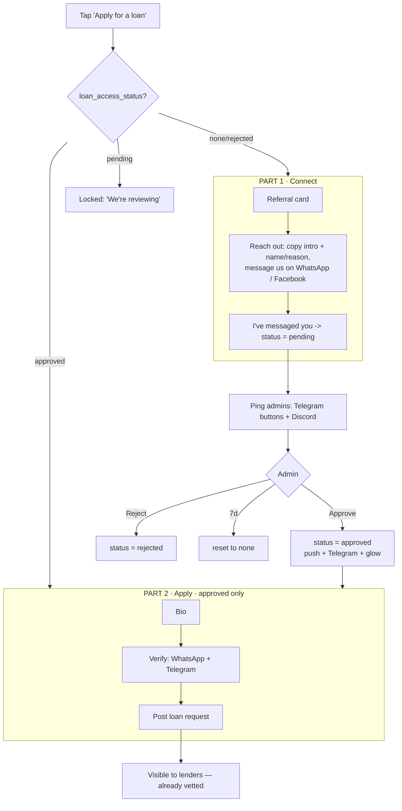
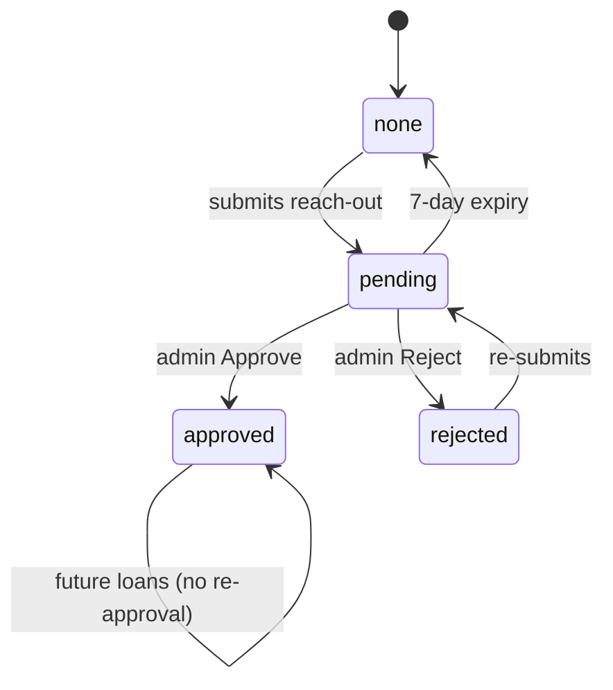

# Moodeng — Loan-Application Gating: Build Log + New "Connect → Approve → Apply" System

**Purpose:** a complete, transferable handoff of everything built for the loan-application gating
flow, plus the full design for the new **Connect → Approve → Apply** system. Written so it can be
dropped into another account/repo and picked up cold.

- **Repo:** `Moodeng-Credit/Moodeng-Credit-Main`
- **Working branch:** `feat/whatsapp-calendly-verification`
- **Open PR:** [#903](https://github.com/Moodeng-Credit/Moodeng-Credit-Main/pull/903)
- **Live Supabase project:** `qplmmxynzxzkfxtayoqr` (dashboard name **"[Dev]Moodeng"**, but it IS the production project)
- **Stack:** React + Vite + TS + Tailwind + Redux · Supabase (Postgres + Deno edge functions) · Telegram/Discord bots · WhatsApp Cloud API · Cal.com / Calendly

---

## PART A — What has been built (this cycle)

"Deployed" = live on the Supabase project via `supabase functions deploy`. Frontend commits deploy via the app's own pipeline.

### A1. WhatsApp contact verification — ✅ LIVE
`wa.me/<number>?text=Verify my Moodeng account: <CODE>` → `whatsapp-webhook` matches server-side →
stamps `users.whatsapp_verified_at`. Proven in production.
Files: `supabase/functions/whatsapp-webhook/`, `src/config/contactVerification.ts`. Secret: `WHATSAPP_VERIFY_TOKEN`.

### A2. Facebook contact — ⚠️ automated Messenger blocked; DIRECTION: WhatsApp+Telegram now, Facebook Login later
Goal was a verified Facebook line. Findings after deep investigation:
- **Automated Messenger is walled.** Receiving/sending messages with the *public* needs Meta App Review of
  `pages_messaging` (Advanced Access) → **months**. `messenger-webhook` (+ `parse.ts`) auto path is scaffolded
  (`m.me/<page>?ref=<CODE>` → referral → stamp `messenger_verified_at`/`messenger_psid`) but works only for app
  testers until review clears.
- **No free GitHub bypass.** The wall is Meta's permission model, not the client code — any official lib uses
  *your* app → same review. Unofficial FB-Chat scrapers (`fca-unofficial`, `ws3-fca`) are free but
  **ToS-violating, ban-prone, credential-storing** → rejected for a lender.
- **Paid bridge (ManyChat/Chatfuel ~$15/mo)** rides *their* pre-approved app (no review) and can auto-forward a
  coded `?ref=` + PSID to our webhook. **Rejected** — ManyChat reviews show unexpected card charges + ignored
  support; too risky as core infra with vendor lock-in.
- **Reversed-code idea** (borrower messages us → our bot DMs them a code → they type it in-app): same wall — the
  bot sending a per-user code to the public still needs `pages_messaging` Advanced Access; the manual version is
  *more* work than the forward one.
- **CHOSEN DIRECTION:** verified line = **WhatsApp + Telegram** (free, official, self-owned, automated, today).
  For a *Facebook* signal, add **"Log in with Facebook" (`public_profile`)** — free, official, self-built via
  Supabase's native Facebook provider + `supabase.auth.linkIdentity({ provider: 'facebook' })`. Needs only the
  Meta app's **App ID + App Secret** (one-time; Supabase supplies the OAuth plumbing, NOT the app — bring your own
  Meta app), plus redirect URL + Privacy Policy + Data-Deletion callback. Verifies a real FB *identity*
  (name/profile), not a DM channel. Still to confirm: whether `public_profile` can go Live for the public without
  Business Verification (check in the Meta app).
- **Manual Messenger** fallback built but **uncommitted/undeployed** (paused): `telegram-webhook` `/confirm <CODE>`
  admin relay + `ContactsStep` "send us this code" UI. Kept only as a $0 stopgap.

Meta app facts: "Moodeng Messaging" (App ID `2672948996473335`, **Live**, runs WhatsApp, has *Facebook Login for
Business*); Messenger use case is addable but needs review; Page is `m.me/MoodengCredit`.

### A3. Contacts step (WhatsApp OR Messenger) — ✅ committed
`src/views/dashboard/components/ContactsStep.tsx` + `src/test/contactsStepVerification.test.ts`. Either verified
channel satisfies the gate. (Reworked in the new system — Part C.)

### A4. Free round-robin video-call booking (Cal.com) — ✅ committed/deployed
Paid Cal.com Teams round-robin rebuilt on the free API: merge both hosts' slots, book whoever's free, show one
anonymous "Moodeng team" list. `verify_jwt` on; identity from JWT.
Files: `supabase/functions/calcom-round-robin/{index.ts,lib.ts,lib.test.ts}`, `calcom-webhook/`,
`src/views/dashboard/components/VideoCallStep.tsx`. Secrets: `CALCOM_API_KEY_GEORGE`, `CALCOM_API_KEY_EMMA`,
`CALCOM_WEBHOOK_SECRET`. **Note:** the new system removes the video-call step.

### A5. Calendly availability read — 🟡 tokens set, rewrite PENDING
Availability lives in **Calendly**; booking stays on free **Cal.com**. Tokens set; the `calcom-round-robin` slots
action still reads Cal.com and needs rewiring to read Calendly.
- Secrets: `CALENDLY_TOKEN_GEORGE`, `CALENDLY_TOKEN_EMMA` (Emma's reissued with `users:read`).
- Event types: George `Video Interview` (`event_types/GGGFAWQGJFGNNJQP`, 15 min) · Emma `15 Minute Meeting`
  (`event_types/8702a2a6-d219-4154-a0dd-a6046b4dd4dc`, 15 min).
- API notes: PATs are JWTs; user URI = `https://api.calendly.com/users/<user_uuid>` (uuid in JWT payload — works
  without `users:read`); `event_type_available_times` needs event_type URI + ≤7-day window; **use `curl`**.
- Rules to apply: next 3 days · before 8pm Bangkok · 6am floor · 15-min slots.

### A6. Video-call UX: timezone + add-to-calendar + no-show reminders — ✅ LIVE (commit `42029a3`)
Local-timezone label; Add-to-Google-Calendar + downloadable .ics (30-min alarm); **`video-call-reminders`** edge
function (pg_cron `*/15`) sends day-before + "starting soon" reminders via web push + Telegram, deduped by
`users.video_call_reminder_stage`. Migration `20260923000000_video_call_reminders.sql` (applied). New push type
`video_call_reminder`.

### A7. Path-aware progress rail — ✅ committed (`f4b09ab`)
`LoanRequestModal` rail spans every real step and shows "Step X of Y"; referred borrowers have one fewer step.
(Revised for the new two-part flow.)

### A8/A9. Team alerts + fixed new-user/KYC Discord — ✅ LIVE (commit `ca6ac69`)
New `supabase/functions/_shared/discord.ts` — `postDiscord(payload,{prefer})` resolves per-feed env then falls
back to **`DISCORD_TEAM_WEBHOOK_URL`** (one secret lights up everything). Signup KYC (`_shared/diditNotifications.ts`)
now posts to Discord; new loan requests (`loan-request-telegram-notification`) fan out to the KYC admin Telegram
channel + Discord on every request; bookings + cash-out face gate routed through the helper. Deployed:
`loan-request-telegram-notification`, `calcom-round-robin`, `didit-webhook`, `check-didit-status`. Secret
`DISCORD_TEAM_WEBHOOK_URL` set. Login feed (`record-session-ip`, `DISCORD_LOGIN_WEBHOOK_URL`) left unchanged.

---

## PART B — Commit list (branch `feat/whatsapp-calendly-verification`)

```
42029a3 Video call: local-timezone label, add-to-calendar, and no-show reminders
f4b09ab Loan request: path-aware progress rail (referred paths are shorter)
ca6ac69 Team alerts: KYC + loan requests now post to Discord and the admin channel
8c61860 Round-robin: alert the admin Telegram channel when a call is booked
65f518c Video-call step: clearer copy
4d1b834 Free round-robin video call: anonymous combined booker via Cal.com API
3cdbf02 Video-call step: free self-assigned round-robin (no paid Teams)
5fbf465 Video-call step: single round-robin Moodeng-team booker
8a8e05a Add targeted "add a social contact" notice for a single borrower
6525501 Add Cal.com video-call setup runbook
036e593 Video-call gate: move to Cal.com with a signed, server-verified webhook
f952a16 Test the contacts step + Messenger webhook parsing
883d13a Verify Facebook via Messenger, mirroring WhatsApp
e8c3887 Contacts step: accept WhatsApp OR Facebook, not WhatsApp-only
f639950 Build the contacts + video-call frontend for the loan-application flow
e7cf3d7 Add WhatsApp verification + Calendly scheduling infra (backend only)
```
**Uncommitted (paused):** `ContactsStep.tsx` + `telegram-webhook/index.ts` (manual Messenger `/confirm`).

---

## PART C — NEW SYSTEM: "Connect → Approve → Apply"

### Why
1. Borrowers post requests before we've vetted them → lenders can fund an unvetted request.
2. We can't reliably reach borrowers (call no-shows; can't help them withdraw once funded).

**Fix:** treat the B2C borrower like a B2B lead — *they reach out first*, we talk to them and **manually
approve**, and only then can they post a loan. A request can only exist for someone we've already spoken to.

### Locked decisions
| # | Decision |
|---|---|
| Trigger | Gate appears when they tap **Apply for a loan** (onboarding/KYC unchanged before it) |
| Order | **Referral card → "Let's connect" card** |
| Referral | **No bypass** — everyone connects *and* is manually approved; referral = credit boost only |
| Reach-out proof | Unverified — "I've messaged you" self-declare; **you** verify by reading the inbox before approving |
| Reach-out channels | WhatsApp + Facebook |
| Approve via | **Telegram (buttons + `/approve`/`/reject`)** primary; Discord notify (+ buttons if feasible) |
| Approval scope | **Per-user, one-time** (approved once → apply freely after) |
| Pending expiry | 7 days → reset (with nudge) |
| Approved signal | **Push notification + glowing Apply button** (+ Telegram if connected) |
| Part-2 verified contacts | **WhatsApp + Telegram** (free/official/automated). Optional **Log in with Facebook** identity add-on. Messenger auto-DM rejected (review + vendor risk). |
| Video call | **Removed entirely** |
| Requests | Approval-before-post is the safeguard (no extra hold flag) |
| Existing users | **Grandfathered → approved** |
| Withdrawal UX | Separate task |

### Flow scheme (see also `docs/loan-gating-scheme.svg`)





### Data model
- `users.loan_access_status` enum `('none','pending','approved','rejected')` default `none`; migration sets all
  existing users → `approved`.
- `users.loan_access_approved_at`, `users.loan_access_seen_at` (drives one-time glow).
- New `loan_access_requests`: `id, user_id, display_name, reason, channel('whatsapp'|'facebook'), status,
  created_at, decided_at, decided_by, expires_at`. One active row per user.

### Frontend
- Apply entry routes on `loan_access_status` (none/rejected→Part1, pending→locked, approved→Part2 + glow until seen).
- New `ConnectStep`: referral (reuse) → reach-out card (copyable template incl. **username**, WhatsApp/Facebook, "I've messaged you").
- `LoanRequestModal` refactor: top-level branch Part 1 vs Part 2 on status; **remove `VideoCallStep`**; Part-2 verify = WhatsApp + Telegram (+ optional FB Login).

### Backend
- `submit-loan-access-request` (edge fn/RPC): set `pending`, insert request row, ping admins (Telegram buttons + Discord).
- `telegram-webhook`: add `callback_query` handling + `/approve <id>` / `/reject <id>` (admin channels only) → set status, `sendPushToUser` + Telegram to borrower.
- `discord-interactions`: approve/reject buttons (enhancement — verify the app handles components; else Discord is notify-only).
- Auto-expire cron (pg_cron, reuse `20260526000000_add_overdue_repayment_notifications.sql` pattern): `pending`→`none` after 7 days + nudge.
- Reuse `_shared/pushDelivery.ts` `sendPushToUser` + `_shared/telegram.ts`.

### Build order
1. Migration (enum + columns + `loan_access_requests` + grandfather) & types.
2. `submit-loan-access-request` + admin ping.
3. `telegram-webhook` approve/reject + borrower push/Telegram.
4. Frontend: status-routed Apply entry + `ConnectStep`; remove video call.
5. Part-2 verified contacts = WhatsApp + Telegram (+ optional FB Login).
6. Auto-expire cron; glow/notification polish.

---

## PART D — Transfer checklist (moving to another account)

Deploy functions: `supabase functions deploy <name> --project-ref <ref>` (needs a `sbp_...` token as
`SUPABASE_ACCESS_TOKEN`; `supabase login` is capped at 20 PATs — delete old ones to unblock).

**Secrets (`supabase secrets set`):**
- Telegram: `TELEGRAM_API_TOKEN`(/`TELEGRAM_BOT_TOKEN`), `TELEGRAM_WEBHOOK_SECRET`, `TELEGRAM_BOT_USERNAME`
- Discord: `DISCORD_TEAM_WEBHOOK_URL` (+ optional per-feed `DISCORD_{BOOKINGS,REQUESTS,KYC,SECURITY,LOGIN}_WEBHOOK_URL`)
- WhatsApp: `WHATSAPP_VERIFY_TOKEN`
- Cal.com: `CALCOM_API_KEY_GEORGE`, `CALCOM_API_KEY_EMMA`, `CALCOM_WEBHOOK_SECRET`
- Calendly: `CALENDLY_TOKEN_GEORGE`, `CALENDLY_TOKEN_EMMA`
- Facebook Login (if pursued): Meta **App ID + App Secret** into Supabase's Facebook provider
- Messenger (if pursued): `MESSENGER_VERIFY_TOKEN`, `MESSENGER_PAGE_ACCESS_TOKEN`
- Core: `SUPABASE_URL`, `SUPABASE_SERVICE_ROLE_KEY`, `SUPABASE_ANON_KEY`, `VITE_SITE_URL`, `VAPID_*`

**`telegram_bot_settings` rows:** `kyc_alert_chat_id` (admin/KYC + requests), `lender_group_chat_id` (lender
broadcast), `team_group_chat_id`/`fraud_alert_chat_id` (bookings/fraud), `lender_notifications_enabled=true`.

**Vault secrets for pg_cron:** `SUPABASE_PROJECT_URL`, `SUPABASE_SECRET_KEY` (every cron `net.http_post`s a function).

**External accounts:** Telegram bot (BotFather) · Discord webhooks/app · Meta app "Moodeng Messaging" (App ID
`2672948996473335`) · Calendly (`calendly.com/moodengcredit`) · Cal.com hosts · Facebook Page `m.me/MoodengCredit`.

---

## PART E — Open decisions / known limitations
- **Facebook messaging (public):** no free/official path — App Review (months) is the only way to *own* it; paid
  bridges (ManyChat) rejected for billing/vendor risk; unofficial scrapers rejected (ToS/ban). **Decision:**
  verified line via WhatsApp+Telegram; pursue **Log in with Facebook** (`public_profile`) for a free FB *identity*
  signal — pending a Meta-app feasibility check (possible Business Verification for public Live). The reversed
  "bot DMs the code" idea hits the same review wall.
- **Calendly-read** rewrite of `calcom-round-robin` slots not done (still reads Cal.com).
- **Video-call meeting provider** (Zoom vs Cal Video vs Meet) not verified on the Cal.com event types.
- **Withdrawal UX** ("funded but can't withdraw") not addressed — separate task.
- **New system not built yet** — this doc is the spec; Part C build order is the plan.
